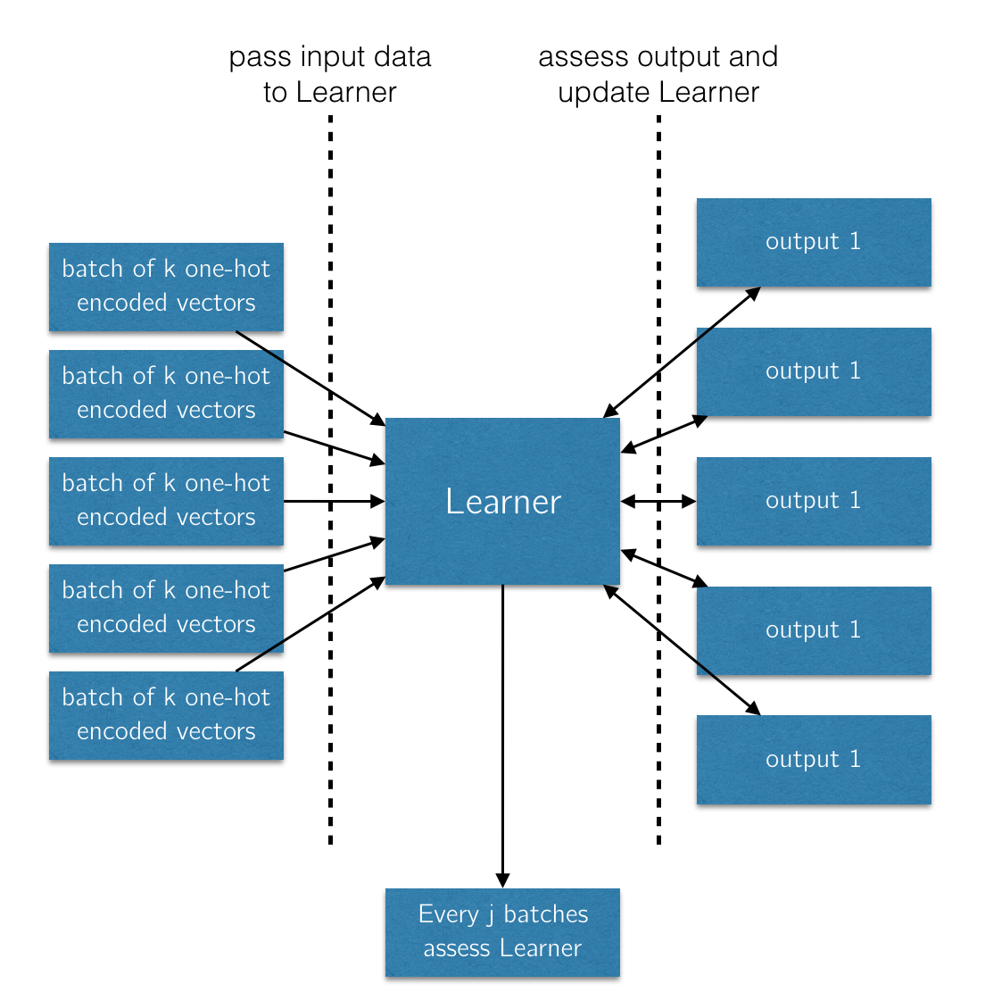
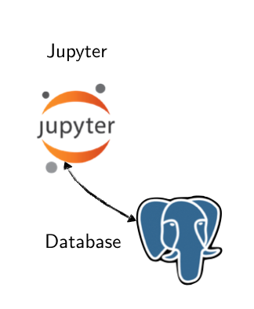
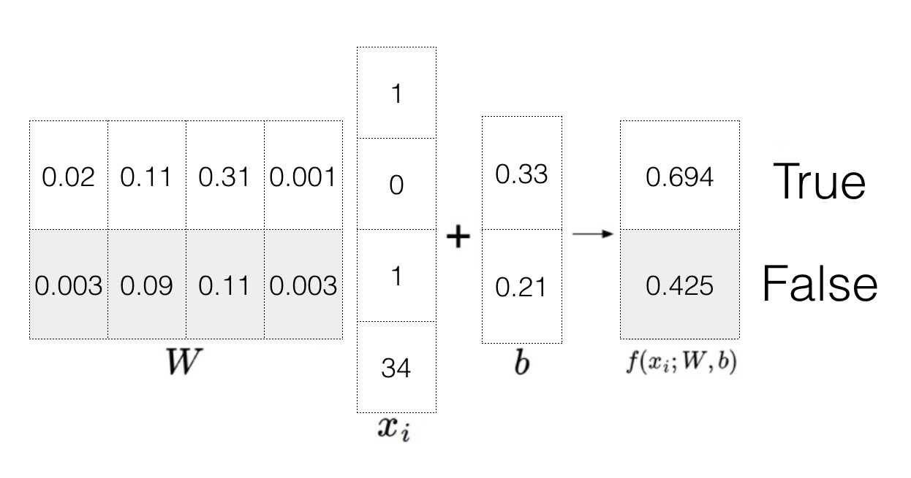
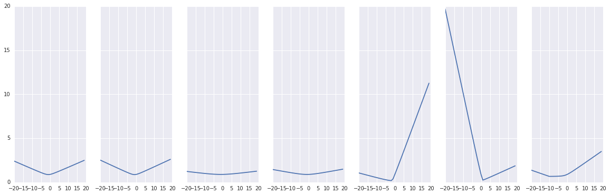
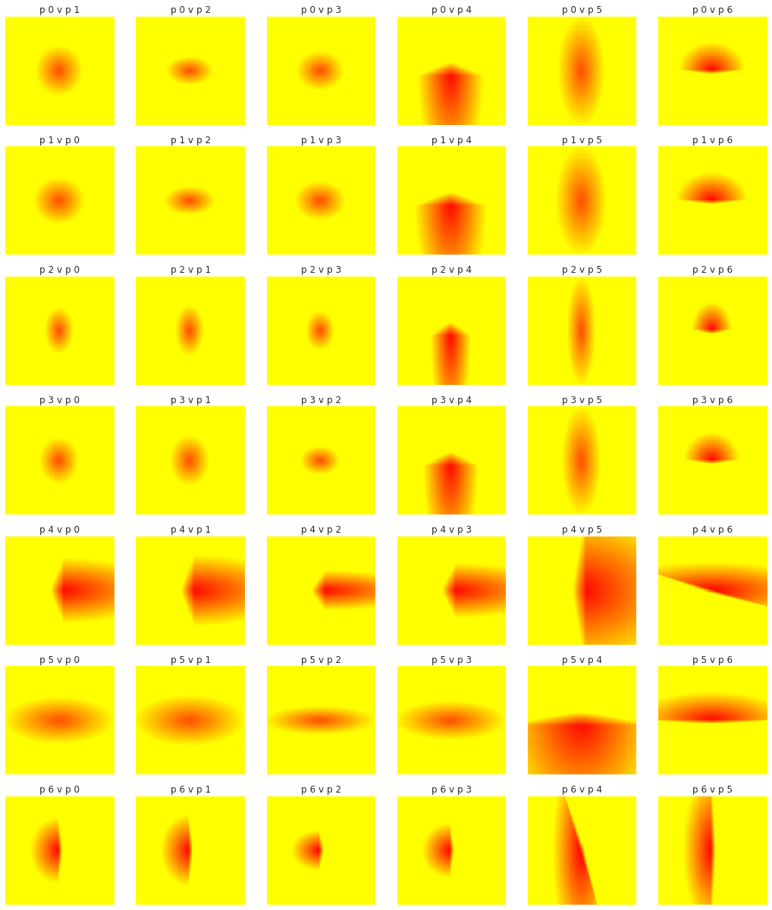

\chapter{Definition}

Please refer to notebook [`1 Definition`](http://joshuacook.me:8003/notebooks/ipynb/1%20Definition.ipynb).

# Problem Statement

In this Kaggle competition, Red Hat seeks an optimal algorithm for using information about a given action and information about a given customer to predict the customer's behavior with regard to that action. A completed product will take the form of a csv with two items per row - an `action_id` from the test set, and a predicted outcome from the set ${0,1}$.

The following is a sample of the required format for a solution submission:

```bash
$ head data/sample_submission.csv

activity_id,outcome
act1_1,0
act1_100006,0
act1_100050,0
act1_100065,0
act1_100068,0
act1_100100,0
```

Data is provided in the form of three separate data sets encoded as CSV:

- `people.csv`
- `act_train.csv`
- `act_test.csv`.

We will store our data in two tables in a PostgreSQL Database. 
The `action` (`act_train.csv`) table makes reference to the `people` (`people.csv`) table. Beyond this, the sets have been scrubbed of any domain specific knowledge. Rather attributes are referred to generically as `char_1`, `char_2`, etc. As such the competition presents an interesting challenge, in which domain knowledge is completely useless. The competition is in essence a "pure machine learning problem."

# Approach

We take the following approach to completing this task:

1. Seed a PostgreSQL database with the three csv files. 
1. One-Hot Encode the data and store the one-hot encoded vector as an array in the `action` table
1. Pull a batch of One-Hot Encoded vectors from the `action` table to pass to a Reinforcement Learner
1. Create, Update, and Store the parameters of the Reinforcement Learner
1. Use the Reinforcement Learner to run a set of predictions on Test Data. 
1. Assess the accuracy of these predictions

Note that while the Kaggle Challenge includes a set of test-data, for the purposes of this study we will be holding a separate test set aside that we are able to run our own local accuracy metrics. At the time of this writing, the competion is closed to new submissions. 

# Metrics
The quality of a solution to this task will be measured using the following test error metric

$$\text{Ave}(I(y_i\neq\hat{y}_i))$$

Here, $I$ is an indicator function which yields 0 if the predicted outcome ($\hat{y}_i$) matches the actual outcome ($y_i$). While the size of the dataset (over 2 million rows in the action set) makes this problem atypical, it is at the end of the day, a binary classifcation problem. As such this simple metric is sufficient to measure our accuracy. 

We will assess the learner against the test set throughout the training process as a way of assessing the development of our learner. However, the results of the development of the assessment will not be uses for training and can thus be used repeatedly as an impartial measure of progress. 



## Infrastructure 

We have designed a special infrastructure geared toward a "back-end"/server-side implementation of our processes. 
This system uses Jupyter notebooks as its main interface, thought it is possible to interface with the system via the terminal. 
Additionally, a browser-based control panel exists for tracking the progress of our workers. 
We use to data management systems, a PostgreSQL database and Redis. 
Finally, we have a worker layer of $n$ scalable worker cpus built using Python's `rq` framework. 


\chapter{Preliminary Data Analysis}

# Connecting to PostgreSQL

Please refer to notebook [`2.01 Preliminary Data Analysis - Connecting to PostgreSQL`](http://joshuacook.me:8003/notebooks/ipynb/2.01%20Preliminary%20Data%20Analysis%20-%20Connecting%20to%20PostgreSQL.ipynb).

We store all included data in a PostgreSQL database. By and large, we access this database using the [`psycopg2`](http://initd.org/psycopg/docs/) library.

```python
import psycopg2

from os import environ
conn = psycopg2.connect(dbname='postgres', 
						user='postgres',
						host=environ['POSTGRES_1_PORT_5432_TCP_ADDR'])
cur = conn.cursor()
```

```python
cur.execute("SELECT COUNT(*) FROM people"); print(cur.fetchone())
cur.execute("SELECT COUNT(*) FROM action"); print(cur.fetchone())
```

    (189118,)
    (2695978,)

```python
conn.close()
```



\pagebreak

# Data Exploration

The data to be used here consists of three datasets:

- `people.csv` [sample](https://github.com/joshuacook/redhat/blob/master/data/people_head.csv)
- `act_train.csv` [sample](https://github.com/joshuacook/redhat/blob/master/data/act_train_head.csv)
- `act_test.csv` [sample](https://github.com/joshuacook/redhat/blob/master/data/act_test_head.csv)

We will do the following to analyze the datasets.

1. seeding the database 
1. basic postgres descriptor (`\d+`)
1. define the basic structure - rows, columns, data types
1. identify unique labels for each column and the counts for each label
1. run aggregates on columns - mean, median, max, min
1. identify duplicate records, if they exist
1. search for NULL data
1. create histograms of data

# Seeding the Database 
This is handled during the building of the Docker image for our PostgreSQL database and is written into our database [Dockerfile](https://github.com/joshuacook/redhat/blob/master/docker/postgres/Dockerfile).

In order to run the commands in this `Dockerfile` we use the `docker-compose` tool to build our image. 

```bash
$ docker-compose build
```

During the building of the image, any `.sql` or `.sh` files located in `/docker-entrypoint-initdb.d` will be executed. 
We have defined the tables we will be using in the `tables.sql` file. The structure will be shown in a moment when we 
run the postgres descriptors. 
The full structure can be viewed in the seeding file [here](https://github.com/joshuacook/redhat/blob/master/docker/postgres/tables.sql). 
This functionality is part of the PostgreSQL public Docker image. 


\pagebreak

# Basic PostgreSQL Descriptors

Having built and run our images, we now have a running PostgreSQL database that has been seeded with our csv data. 

## Descriptor for database
We use the PostgreSQL descriptor command to display basic attributes of our database. 

```
postgres=# \d+
                          List of relations
 Schema |      Name       | Type  |  Owner   |  Size   | Description
--------+-----------------+-------+----------+---------+-------------
 public | action          | table | postgres | 235 MB  |
 public | people          | table | postgres | 30 MB   |
``` 

## Descriptor for `action` table

We can repeat the same for a particular table. The tables have been trimmed so as not to show columns of repeating type.

```
postgres=# \d+ action
           Table "public.action"
    Column    |            Type             | 
--------------+-----------------------------+
 people_id    | text                        | 
 act_id       | text                        | 
 act_date     | timestamp without time zone | 
 act_category | text                        | 
 act_char_1   | text                        | 
                   ...
 act_char_10  | text                        | 
 act_outcome  | boolean                     | 
Indexes:
    "action_pkey" PRIMARY KEY, btree (act_id)
Foreign-key constraints:
    "action_people_id_fkey" FOREIGN KEY (people_id) REFERENCES people(people_id)
```

\pagebreak

## Descriptor for `people` table

```
postgres=# \d+ people
                Table "public.people"
   Column    |            Type             | Modifiers |
-------------+-----------------------------+-----------+
 people_id   | text                        | not null  |
 ppl_char_1  | text                        |           |
 ppl_group_1 | text                        |           |
 ppl_char_2  | text                        |           |
 ppl_date    | timestamp without time zone |           |
 ppl_char_3  | text                        |           |
                           ...
 ppl_char_9  | text                        |           |
 ppl_char_10 | boolean                     |           |
 ppl_char_11 | boolean                     |           |
 ppl_char_12 | boolean                     |           |
                           ...
 ppl_char_37 | boolean                     |           |
 ppl_char_38 | real                        |           |
Indexes:
    "people_pkey" PRIMARY KEY, btree (people_id)
Referenced by:
    TABLE "action" CONSTRAINT "action_people_id_fkey" 
        FOREIGN KEY (people_id) REFERENCES people(people_id)
```
\pagebreak 

# Define the Basic Structure

Please refer to notebook [`2.05 Preliminary Data Analysis - Define the Basic Structure`](http://joshuacook.me:8003/notebooks/ipynb/2.01%20Preliminary%20Data%20Analysis%20-%20Define%20the%20Basic%20Structure.ipynb).

**TODO: Jupyter File**

The number of rows in a set can be identified by a query using the `COUNT()` function.
Our test and training sets can be identified by the fact that the test set has `NULL` values in the `act_outcome` column.

## Number of Rows in database tables

| database | number of rows | number of training rows |
|:--------:|:--------------:|:-----------------------:|
| `people` | 189118         | N/A                     |
| `action` | 2695978        | 498687                  |

## Number of Columns per Data Type

| database | text | boolean | timestamp | real |
|:--------:|:----:|:-------:|:---------:|:-----|
| `people` | 11   | 28      | 1         | 0    |
| `action` | 13   | 1       | 1         | 1    |

# Identify Unique Labels 

## Number of Unique Labels for `people`

| label       | unique |
|:-----------:|:-------|
| people_id   | 189118 |
| ppl_group_1 | 34224  |
| ppl_date    | 1196   |
| ppl_char_1  | 2      |
| ppl_char_2  | 3      |
| ppl_char_3  | 43     |
| ppl_char_4  | 25     |
| ppl_char_5  | 9      |
| ppl_char_6  | 7      |
| ppl_char_7  | 25     |
| ppl_char_8  | 8      |
| ppl_char_9  | 9      |

Additionally we do not show the final group of columns for the following reasons. `ppl_char_10` through `ppl_char_37` are boolean and have only two labels - `TRUE` and `FALSE`.

`ppl_char_38` is a continuous valued column. 

## Number of Unique Labels for `action`

Again we first show columns that have too many labels. However, upon second consideration we should use the column `act_category`.

| label        | unique  |
|:------------:|:-------:|
| act_id       | 2695978 |
| act_date     | 411     |
| act_category | 7       |
| act_char_1   | 51      |
| act_char_2   | 32      |
| act_char_3   | 11      |
| act_char_4   |  7      |
| act_char_5   |  7      |
| act_char_6   |  5      |
| act_char_7   |  8      |
| act_char_8   | 18      |
| act_char_9   | 19      |
| act_char_10  | 6969    |

We do not show the outcome `act_outcome` because it is boolean.

# Run Aggregates on Columns

Next we take the average of our boolean columns. Note that all of them skew to the negation, most of them heavily so. The only exception is `act_outcome` which, while still toward the negation, is closer to the middle.

| label       | mean     |
|:-----------:|:--------:|
| ppl_char_10 | (0.2509) | 
| ppl_char_11 | (0.2155) | 
| ppl_char_12 | (0.2403) | 
| ppl_char_13 | (0.3651) | 
| ppl_char_14 | (0.2598)
| ppl_char_15 | (0.2695) | 
| ppl_char_16 | (0.2821) | 
| ppl_char_17 | (0.2920) | 
| ppl_char_18 | (0.1876) | 
| ppl_char_19 | (0.2847)
| ppl_char_20 | (0.2291) | 
| ppl_char_21 | (0.2850) | 
| ppl_char_22 | (0.2911) | 
| ppl_char_23 | (0.2985) | 
| ppl_char_24 | (0.1904)
| ppl_char_25 | (0.3278) | 
| ppl_char_26 | (0.1670) | 
| ppl_char_27 | (0.2381) | 
| ppl_char_28 | (0.2889) | 
| ppl_char_29 | (0.1683)
| ppl_char_30 | (0.2069) | 
| ppl_char_31 | (0.2786) | 
| ppl_char_32 | (0.2849) | 
| ppl_char_33 | (0.2178) | 
| ppl_char_34 | (0.3565) |
| ppl_char_35 | (0.2103) | 
| ppl_char_36 | (0.3437) | 
| ppl_char_37 | (0.2855) | 
| act_outcome | (0.4440) |

Then we take the average, maximum, and minimum of the single real-valued column. 

```
SELECT AVG(ppl_char_38), MAX(ppl_char_38), MIN(ppl_char_38) FROM people;
       avg        | max | min
------------------+-----+-----
 50.3273987669074 | 100 |   0
(1 row)
```

# Identify Duplicate Records

Note that there are 189118 `people_id` values, one for each row. We can take this to mean that there are no duplicate entries in the `people` dataset. 
The same is true with actions with 2695978 unique `act_id` values. 

# Search for NULL Data
There is null data in these datasets, in two locations. There are null values in the boolean variables attached to the `action` table. 
We will be handling this data, however, when we process the data for handoff to the neural network. Additionally, there are null values in
the `act_outcome` column, but this is functional as a null value in this field signifies a **test** action as opposed to a **train** action.

\pagebreak

# Create Histograms of Data

Please refer to notebook [`2.10 Preliminary Data Analysis - Create Histograms of Data`](http://joshuacook.me:8003/notebooks/ipynb/2.10%20Preliminary%20Data%20Analysis%20-%20Create%20Histograms%20of%20Data.ipynb).

Finally, we use the Python library [`seaborn`](https://stanford.edu/~mwaskom/software/seaborn/) to create plots of our data as histograms.

First, we import the necessary libraries, then instantiate a connection to our database.

```python
import psycopg2
import numpy as np
import matplotlib.pyplot as plt
import seaborn as sns
%matplotlib inline

from os import environ
conn = psycopg2.connect(dbname='postgres', 
						user='postgres', 
						host=environ['POSTGRES_1_PORT_5432_TCP_ADDR'])
cur = conn.cursor()
```

\pagebreak

Next, we define a function that we will use to create numbered bins four distinct labels for each column.

```python
column = 'ppl_char_1'
def hist_buckets(column, table, cur):
    sql = "SELECT DISTINCT {} FROM {};".format(column,table)
    cur.execute(sql)

    labels = [str(l[0]) for l in cur.fetchall()]
    labels.sort()
    sql = "SELECT {} FROM ".format(','.join(labels).replace(' ','_'))
    sql_rows = ["""(SELECT COUNT({}) 
                    FROM {} 
                    WHERE {} = '{}') as {}""".format(column,
                    								 table,
                    								 column,
                    								 label,
                    								 label.replace(' ','_')) 
                    								 
                    								 for label in labels]

    sql += ",".join(sql_rows)
    
    cur.execute(sql)
    bins = cur.fetchall()[0]
    bins = [int(bn.replace('(','').replace(')','')) for bn in bins]
    return bins, labels


```

Then, we define a function to create our bar plot. We are using the `seaborn` library which is designed to create beautiful plots with minimal configuration. 

```python
def bar_plot(col,table,cur):
    vals,labels = hist_buckets(col,table,cur)
    x = np.arange(len(vals))
    y = np.array(vals)
    f = plt.figure(figsize=(12,3))
    ax = f.add_axes([0.1, 0.1, 0.8, 0.8])
    sns.barplot(x=x, y=y,palette='Greens_d')
    ax.set_title("Counts for {} in {}".format(col,table))
    ax.set_xticks(x)
    ax.set_xticklabels([label.replace('type ','') for label in labels])
```

```python
bar_plot('ppl_char_1','people',cur)
bar_plot('ppl_char_2','people',cur)
bar_plot('ppl_char_3','people',cur)
bar_plot('ppl_char_4','people',cur)
bar_plot('ppl_char_5','people',cur)
bar_plot('ppl_char_6','people',cur)
bar_plot('ppl_char_7','people',cur)
bar_plot('ppl_char_8','people',cur)
bar_plot('ppl_char_9','people',cur)
bar_plot('act_char_1','action',cur)
bar_plot('act_char_2','action',cur)
bar_plot('act_char_3','action',cur)
bar_plot('act_char_4','action',cur)
bar_plot('act_char_5','action',cur)
bar_plot('act_char_6','action',cur)
bar_plot('act_char_7','action',cur)
bar_plot('act_char_8','action',cur)
bar_plot('act_char_9','action',cur)
```


\chapter{Algorithms and Techniques}

# One-Hot Encoding

Please refer to notebook [`3.01 Algorithms and Techniques - One-Hot Encoding Example`](http://joshuacook.me:8003/notebooks/ipynb/3.01%20Algorithms%20and%20Techniques%20-%20One-Hot%20Encoding%20Example.ipynb).

We will use the One-Hot Encoding algorithm to convert our categorical data to numerical data. It may be tempting to merely convert our categories to numbers i.e. `type 01` $\to$ 1, `type 02` $\to$ 2, however, such an encoding of data implies a linear relationship between our categories, where there may be none. 

> In one-hot encoding, a separate bit of state is used for each state. It is called one-hot because only one bit is “hot” or TRUE at any time. (Harris, David, and Sarah Harris. Digital design and computer architecture. Elsevier, 2012.)

This algorithm is also referred to as 1-of-K encoding. An example will be helpful in illustrating the concept. 

\pagebreak

## One-Hot Encoding Example

```python
import psycopg2
import numpy as np
from os import environ
conn = psycopg2.connect(dbname='postgres', 
						user='postgres', 
						host=environ['POSTGRES_1_PORT_5432_TCP_ADDR'])
cur = conn.cursor()

 cur.execute("SELECT ppl_char_1,ppl_char_2 FROM people LIMIT 10")
this_row = cur.fetchone()
one_hot = []
while this_row:
    one_hot.append([
            this_row[0] == 'type 1',
            this_row[0] == 'type 2',
            this_row[1] == 'type 1',
            this_row[1] == 'type 2',
            this_row[1] == 'type 3',
        ])
    this_row = cur.fetchone()
print(np.array(one_hot, dtype=int))

[[0 1 0 1 0]
 [0 1 0 0 1]
 [0 1 0 0 1]
 [0 1 0 0 1]
 [0 1 0 0 1]
 [0 1 0 0 1]
 [0 1 0 1 0]
 [0 1 0 0 1]
 [0 1 0 0 1]
 [0 1 0 0 1]]
 
```

Here, we select two columns from our database. For each available type for each column, we do a Boolean check and then cast this check to an integer. The result is that for a given group of columns corresponding to a single column in our original database, there will be a single `1` and the remainder will be `0`. We use one-hot coding because the categorical and boolean nature of the vast majority of our data lends itself to this technique. 

# Linear Classification via Neural Network

Linear classification will be the core algorithm upon which we will build our neural network classifier. We borrow heavily for this approach from Andrej Karpathy's [notes](http://cs231n.github.io/linear-classify/) for his Convolutional Neural Networks course:

> The approach will have two major components: a **score function** that maps the raw data to class scores, and a **loss function** that quantifies the agreement between the predicted scores and the ground truth labels.

## Score Function
We will develop a score function that maps input vectors to class scores

$$f: \mathbb{R^D} \mapsto \mathbb{R}^2$$ 

where $D$ is the dimension of our one-hot encoded vectors and 2 represents the 2 classes of our binary classifier. Then, 

$$f(x_i, W, b)=Wx_i+b=y$$

where $x_i$ is a particular input vector, $W$ is a matrix of weights (dimension $2 \times n$), $b$ is a bias vector, and $y$ is a score vector with a score for each class. 



## Loss Function

Note that of the inputs to our score function we do not have control over the $x_i$s. Instead, we must change $W$ and $b$ to match a set of given $y$s. To do this we will define a loss function that measures our performance. We will use one of the most common loss functions the multiclass support vector machine. Here the loss for a given vector is 

$$L_i=\sum_{j\neq y_i}\max(0,s_j-s_{y_i}+\Delta)$$

Here, $s$ is the vector result of our score function and $y_i$ is the correct class. Our loss function computes a scalar value by comparing each incorrect class score to the correct class score. We expect the score of the correct class to be at least $\Delta$ larger than the score of each incorrect class.

## Regularization Penalty
It is possible that more than one set of weights could provide an optimal response to our loss function. In order to prioritize the smallest possible weights we will add a regularization penalty to our loss function. Again we will go with a common technique and use the L2 norm. 

$$R(W)=\sum_k\sum_lW^2_{k,l}$$

Additionally, including a regularizatiom penalty has the added benefit of helping to prevent overfitting.  

## Final Loss Function

$$L=\frac{1}{N}\sum_iL_i+\lambda R(W)$$

Here, $\lambda$ is a hyper parameter to be fit by cross-validation and $N$ is a batch size.

# Optimization

Possibile methods:

## Randomly guessing

  - we initialize a weights matrix, $W_{cur}$
  - for each vector (or batch of vectors) passed to the learner, we generate a new weights matrix, $W_{i}$
  - if the new weights, $W_{i}$ is better in score than $W_{cur}$, we assign it to $W_{cur}$ 
    $$W_{cur} \to W_i$$
  - repeat for all of our test vectors

## Random Local Search
  - we initilialize a weights matrix, $W$
  - for each batch of vectors passed, we generate a random matrix, $\Delta W$, of the same dimension as $W$ and scaled by some factor, $\nu$
  - we measure the loss against the sum $W+\nu\Delta W$. 
  - If $W + \nu\Delta W$ has a better score than $W$, we assign it to $W$
    $$W + \nu\Delta W \to W$$
  - repeat for all of our test vectors

## Gradient Descent
  - compute the best direction along which we should change our weight matrix that is mathematically guaranteed to be the direction of the steepest descent
  - the gradient is a vector of derivatives for each dimension in the input space
  - calculate the gradient and use this calculation to update the weight matrix
    $$W_{new} = W - \nabla L$$

# Benchmark

The quality of a solution to this task will be measured using the following test error metric

$$\text{Ave}(I(y_i\neq\hat{y}_i))$$

Here, $I$ is an indicator function which yields 0 if the predicted outcome ($\hat{y}_i$) matches the actual outcome ($y_i$), and returns 1 otherwise. While the size of the dataset (over 2 million rows in the action set) makes this problem atypical, it is at the end of the day, a binary classification problem. As such this simple metric is sufficient to measure our accuracy. 

Of note is that, while the outcome is clearly defined by the contest, for the purposes of this project, we will be using a portion of the training set as our benchmark. 

\chapter{Exploratory Visualization}

# Visualizing the Loss Function

Please refer to notebook [`4.01 Exploratory Visualization - Visualizing the Loss Function`](http://joshuacook.me:8003/notebooks/ipynb/4.01%20Exploratory%20Visualization%20-%20Visualizing%20the%20Loss%20Function.ipynb).

A relevant visualization to this task is that of the loss function. For this visualizaton, we again turn to Andrej Karpathy's [notes](http://cs231n.github.io/optimization-1/). 


While we will have difficulty visualizing the loss function over the complete weight space, we can visualize it over a smaller space to begin to understand our approach. 


```python
import numpy as np
import matplotlib.pyplot as plt
import seaborn as sns
%precision 1
%matplotlib inline
```

For the purposes of this visualization, let us consider a small random weight matrix $(2,p)$ for a binary classifier, i.e., one weight vector for each classifier.

We then generate a random input vector $x$ (with 6 parameters, and then a trailing bias) and and a vector of outputs. 

Finally, we randomly select a correct outcome for a binary classifier.


```python
W = np.random.rand(2,7)
x = np.random.randint(2, size=7)
x[6] = 1
correct_class = np.random.randint(2)
```


```python
W
```


    array([[ 0.3,  0.5,  0.3,  0. ,  0.5,  0.1,  0.5],
           [ 0.8,  0.8,  0.1,  0.4,  0. ,  0.9,  0.5]])


```python
x
```


    array([0, 0, 0, 0, 1, 1, 1])


We then obtain our scores by multiplying 

$$\texttt{scores}=Wx$$

The first score is for our first classifier, the second for the second classifier. A score signifies how likely it is that the given classifier is the correct classifier. 


```python
scores = W.dot(x)
scores
```


    array([ 1.2,  1.4])


Next, we write a loss function for a single input vector. 


```python
from numpy.linalg import norm
def loss_function_i(correct_class,x,W,delta=1.0,gamma=0.1):
    scores = W.dot(x)
    correct_score = scores[correct_class]
    margins = np.maximum(0, scores - correct_score + delta)
    margins[correct_class] = 0
    return np.sum(margins) + gamma*norm(W)
```


```python
loss_function_i(correct_class,x,W)
```


    0.9


Finally, we vary the loss function for a single input with different weights for a single parameter, `param`. 


```python
def loss_function_in_a_direction(variable_weight,
                                 param,
                                 correct_class,
                                 x,W):
    delta_W = np.zeros(W.shape)
    delta_W[:,param] += int(variable_weight)*W[:,param]
    return loss_function_i(correct_class,x,W+delta_W)
```


```python
loss_function_in_a_direction(1,1,correct_class,x,W)
```


    1.0


And then plot this function along various values of `variable_weight` for all of our `params` values. 


```python
def plot_loss_function_for_a_single_parameter(plot_axis,param,correct_class,x,W):
    dependent_vector = [loss_function_in_a_direction(variable_weight,
                                                     param,
                                                     correct_class,
                                                     x,W) 
                        for variable_weight in range(-20,20)]
    plot_axis.plot(range(-20,20),dependent_vector)
    
def render_all_plots(correct_class,x,W):
    figure, axes = plt.subplots(1,7, sharex=True, sharey=True, figsize=(20,6))
    for param, axis in zip(range(7),axes):
        plot_loss_function_for_a_single_parameter(axis,param,correct_class,x,W)    
```


```python
render_all_plots(correct_class,x,W)
```





It is of note that every parameter is convex and can be minimized. 


```python
def loss_function_in_two_directions(a,p_1,b,p_2,correct_class,x,W):
    delta_W = np.zeros(W.shape)
    delta_W[:,p_1] += int(a)*W[:,p_1]
    delta_W[:,p_2] += int(b)*W[:,p_2]
    return loss_function_i(correct_class,x,W+delta_W)


```

We can also do the same for a comparison of two varied parameters. Again, note that each of these plots is convex. 


```python
def build_heat_map_for_two_parameters(p_1,p_2,min_val,max_val,nx,correct,x,W):
    X = np.linspace(min_val, max_val, nx)
    Y = np.linspace(min_val, max_val, nx)
    return [[loss_function_in_two_directions(xv,p_1,yv,p_2,correct,x,W)
             for xv in X]
            for yv in Y]
```


```python
def plot_heatmap(plot_axis,p_1,p_2,correct,x,W):
    this_heat_map = build_heat_map_for_two_parameters(p_1,p_2,-100,100,50,correct,x,W)
    sns.heatmap(this_heat_map,
                cmap='autumn', 
                cbar=False, 
                xticklabels=False, 
                yticklabels=False, 
                vmin=0,vmax=5,
                ax=plot_axis)
    
def render_all_plots(correct_class,x,W):
    plt.figure(figsize=(18,21))
    figure, axes = plt.subplots(7,6, sharex=True, sharey=True, figsize=(18,21))
    for p_1, axes_i in zip(range(7),axes):        
        p_2s = [i for i in range(7)]
        p_2s.remove(p_1) 
        for p_2, axis in zip(p_2s, axes_i):
            plot_heatmap(axis,p_1,p_2,correct_class,x,W)
            axis.set_title("p {} v p {}".format(str(p_1),str(p_2)))

```


```python
render_all_plots(correct_class,x,W)
```


    <matplotlib.figure.Figure at 0x7f676d94f9b0>




\chapter{Data Preprocessing}

# CSV Manipulation

The dataset was a set provided by Kaggle. As such, it was already well structured and clean. Still, in order to facilitate processing, some work had to be done on the csv data itself. 

## `act_train.csv`

An additional column had to be added to the csv in order to ultimately provide a null space in which to insert our `act_one_hot_encoded` binary value. This was done via the `sed` command line tool by adding a comma to each line. 

```bash
$ sed -e 's/$/,/' -i act_train.csv > new_act_train.csv 
```

## `act_test.csv`

For the test data set, we needed to add two columns, one for the null outcome (test and train are stored in the same table and distinguished by having a true, false or null value) and the same null space in which to insert the `act_one_hot_encoded` binary value. 

```bash
$ sed -e 's/$/,/' -i act_test.csv > new_act_test.csv 
```

## All Sets

Additionally, we wanted to convert all attributes to double digit attributes i.e. `char 1` $\to$ `char 01`. 

```bash
$ sed -e 's/,char (\d),/,char 0\1,/' -i act_train.csv > new_act_train.csv
```

**In this section, all of your preprocessing steps will need to be clearly documented, if any were necessary. From the previous section, any of the abnormalities or characteristics that you identified about the dataset will be addressed and corrected here. Questions to ask yourself when writing this section:**

# One-Hot Encoding

We will be storing our one-hot encoded numpy arrays as binary data in the `action` table column `act_one_hot_encoded`. Here is a minimal implementation of this. 

```python
import psycopg2
import numpy as np
from os import environ
conn = psycopg2.connect(dbname='postgres', 
						user='postgres',
						host=environ['POSTGRES_1_PORT_5432_TCP_ADDR'])
cur = conn.cursor()

def update_one_hot_encoding(vector, action_id):
    sql = """
        UPDATE action 
        SET act_one_hot_encoding = {}
        WHERE act_id='{}'
        """.format(psycopg2.Binary(vector), action_id)
    cur.execute(sql)
    conn.commit()
    
eye_3 = np.eye(3)

update_one_hot_encoding(conn, cur, eye_4, action_id)
```

Next, we verify that the vector was properly stored.

```python
def fetch_one_hot_encoding(conn, cur, action_id):
    sql = """
        SELECT act_one_hot_encoding
        FROM action
        WHERE act_id='{}'
        """.format(action_id)
    cur.execute(sql)
    buf = cur.fetchone()[0]
    return np.frombuffer(buf)
    


fetch_one_hot_encoding(conn, cur, action_id)
array([ 1.,  0.,  0.,  0.,  1.,  0.,  0.,  0.,  1.])
```


\chapter{Implementation}

# Steps to Implementation

1. Seed a PostgreSQL database with the three csv files. 
1. One-Hot Encode the data and store the one-hot encoded vector as an array in the `action` table
1. Pull a batch of One-Hot Encoded vectors from the `action` table to pass to a Reinforcement Learner
1. Create, Update, and Store the parameters of the Reinforcement Learner
1. Use the Reinforcement Learner to run a set of predictions on Test Data. 
1. Assess the accuracy of these predictions

# Seed a PostgreSQL database with the three csv files. 
This step is done at instantiation of the system. Refer to [Seeding the Database](#seeding-the-database).

# One-Hot Encode the data and store the one-hot encoded vector as an array in the `action` table
Please refer to notebook [`6.03 Implementation - Write One-Hot to Action Table`](http://joshuacook.me:8003/notebooks/ipynb/6.03%20Implementation%20-%20Write%20One-Hot%20to%20Action%20Table.ipynb).

```python
from os import chdir
chdir('../')
```

```python
mport psycopg2
import numpy as np
from os import environ
from lib.app import Q
from lib.helpers.database_helper import one_hot_encode_row, \
    one_hot_from_table, pull_actions_and_one_hot_encode
```

```python
 i = 0
 while i < 100 :
    Q.enqueue(pull_actions_and_one_hot_encode)
    i += 1
```

We have written a library to handle the one-hot encoding of the data. `one_hot_encode_row` does a join on the action and people tables, converts the tables and categories to one-hot encoded data, converts this to a binary `numpy` vector, and writes this binary to the action table. `pull_actions_and_one_hot_encode` does this 1000 times for actions from the action table that do not yet have one-hot encoded vectors. 

Note that we are also using our delayed job system to do the conversion. Once jobs have been enqueued, the status of enqueued jobs can be tracked [here](http://joshuacook.me:8002/rq/default).

# Pull a batch of One-Hot Encoded vectors from the `action` table to pass to a Reinforcement Learner

Please refer to notebook [`6.04 Implementation - Pull Batch of One-Hot Encoded Vectors`](http://joshuacook.me:8003/notebooks/ipynb/6.04%20Implementation%20-%20Pull%20Batch%20of%20One-Hot%20Encoded%20Vectors.ipynb).

```python
action_ids = pull_actions(action_type='training')


``


# Create, Update, and Store the parameters of the Reinforcement Learner

Please refer to notebook [`6.05 Implementation - Create, Update, and Store RL parameters`](http://joshuacook.me:8003/notebooks/ipynb/6.05%20Create,%20Update,%20and%20Store%20RL%20parameters.ipynb).

# Use the Reinforcement Learner to run a set of predictions on Test Data. 

Please refer to notebook [`6.06 Implementation - Run Predictions`](http://joshuacook.me:8003/notebooks/ipynb/6.06%20Implementation%20-%20Run%20Predictions.ipynb).

# Assess the accuracy of these predictions

In this section, the process for which metrics, algorithms, and techniques that you implemented for the given data will need to be clearly documented. It should be abundantly clear how the implementation was carried out, and discussion should be made regarding any complications that occurred during this process. Questions to ask yourself when writing this section:
- _Is it made clear how the algorithms and techniques were implemented with the given datasets or input data?_
- _Were there any complications with the original metrics or techniques that required changing prior to acquiring a solution?_
- _Was there any part of the coding process (e.g., writing complicated functions) that should be documented?_


\chapter{Refinement}
In this section, you will need to discuss the process of improvement you made upon the algorithms and techniques you used in your implementation. For example, adjusting parameters for certain models to acquire improved solutions would fall under the refinement category. Your initial and final solutions should be reported, as well as any significant intermediate results as necessary. Questions to ask yourself when writing this section:
- _Has an initial solution been found and clearly reported?_
- _Is the process of improvement clearly documented, such as what techniques were used?_
- _Are intermediate and final solutions clearly reported as the process is improved?_


\chapter{Results}
_(approx. 2-3 pages)_

# Model Evaluation and Validation
In this section, the final model and any supporting qualities should be evaluated in detail. It should be clear how the final model was derived and why this model was chosen. In addition, some type of analysis should be used to validate the robustness of this model and its solution, such as manipulating the input data or environment to see how the model’s solution is affected (this is called sensitivity analysis). Questions to ask yourself when writing this section:
- _Is the final model reasonable and aligning with solution expectations? Are the final parameters of the model appropriate?_
- _Has the final model been tested with various inputs to evaluate whether the model generalizes well to unseen data?_
- _Is the model robust enough for the problem? Do small perturbations (changes) in training data or the input space greatly affect the results?_
- _Can results found from the model be trusted?_

# Justification
In this section, your model’s final solution and its results should be compared to the benchmark you established earlier in the project using some type of statistical analysis. You should also justify whether these results and the solution are significant enough to have solved the problem posed in the project. Questions to ask yourself when writing this section:
- _Are the final results found stronger than the benchmark result reported earlier?_
- _Have you thoroughly analyzed and discussed the final solution?_
- _Is the final solution significant enough to have solved the problem?_


\chapter{Conclusion}
_(approx. 1-2 pages)_

# Free-Form Visualization
In this section, you will need to provide some form of visualization that emphasizes an important quality about the project. It is much more free-form, but should reasonably support a significant result or characteristic about the problem that you want to discuss. Questions to ask yourself when writing this section:
- _Have you visualized a relevant or important quality about the problem, dataset, input data, or results?_
- _Is the visualization thoroughly analyzed and discussed?_
- _If a plot is provided, are the axes, title, and datum clearly defined?_

# Reflection
In this section, you will summarize the entire end-to-end problem solution and discuss one or two particular aspects of the project you found interesting or difficult. You are expected to reflect on the project as a whole to show that you have a firm understanding of the entire process employed in your work. Questions to ask yourself when writing this section:
- _Have you thoroughly summarized the entire process you used for this project?_
- _Were there any interesting aspects of the project?_
- _Were there any difficult aspects of the project?_
- _Does the final model and solution fit your expectations for the problem, and should it be used in a general setting to solve these types of problems?_

# Improvement
In this section, you will need to provide discussion as to how one aspect of the implementation you designed could be improved. As an example, consider ways your implementation can be made more general, and what would need to be modified. You do not need to make this improvement, but the potential solutions resulting from these changes are considered and compared/contrasted to your current solution. Questions to ask yourself when writing this section:
- _Are there further improvements that could be made on the algorithms or techniques you used in this project?_
- _Were there algorithms or techniques you researched that you did not know how to implement, but would consider using if you knew how?_
- _If you used your final solution as the new benchmark, do you think an even better solution exists?_

-----------

**Before submitting, ask yourself. . .**

- Does the project report you’ve written follow a well-organized structure similar to that of the project template?
- Is each section (particularly **Analysis** and **Methodology**) written in a clear, concise and specific fashion? Are there any ambiguous terms or phrases that need clarification?
- Would the intended audience of your project be able to understand your analysis, methods, and results?
- Have you properly proof-read your project report to assure there are minimal grammatical and spelling mistakes?
- Are all the resources used for this project correctly cited and referenced?
- Is the code that implements your solution easily readable and properly commented?
- Does the code execute without error and produce results similar to those reported?


# Appendix

<a 
## `Dockerfile`

```
 docker/postgres/Dockerfile
FROM postgres
COPY tables.sql /docker-entrypoint-initdb.d/tables.sql
COPY act_test.csv /docker-entrypoint-init.d/act_test.csv
COPY act_train.csv /docker-entrypoint-init.d/act_train.csv
COPY people.
csv /docker-entrypoint-init.d/people.csv
```
##  
